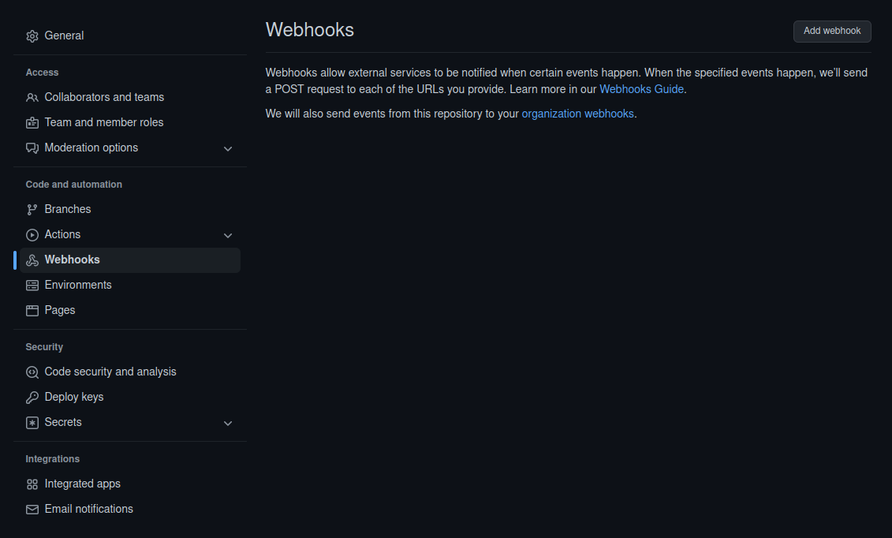
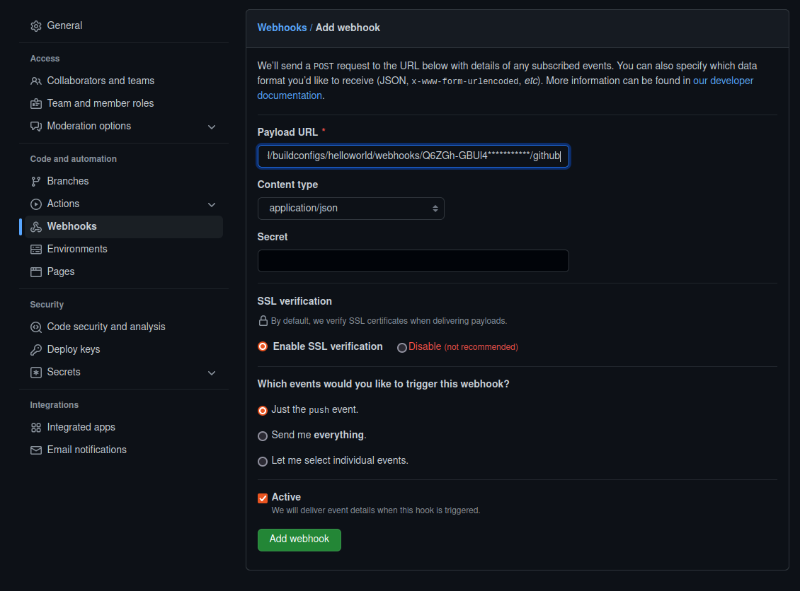

## Deploy an application from source code

### Table of contents

1.  Introduction
2.  Create an application from source
3.  Examining the resources
4.  Routes
5.  Demo: Change the source code and restart the build
6.  Demo: Automatic build via GitHub Webhooks

### 1. Introduction

We mentioned in the previous lab that there are three ways to create an application with _oc new-app_. We saw how to deploy an application from an existing docker image. In this lab, we are going to explore how to deploy an application directly from source code.

With OpenShift it is possible to create applications direct from source. The _BuildConfig_ and _ImageStream_ resources (build-related artifacts) don't exist in Kubernetes, this is one of the main differences between Kubernetes and OpenShift.

OpenShift relies internally on _Source-to-Image (S2I)_ to build reproducible, docker-formatted container images.

### 2. Create an application from source

**Demonstration:** use the OpenShift Web Console (Optional)

_The teacher might show first how to create an application from source on the web console._

**Exercise:** Create an application from source from the command line

For this lab, we have prepared a simple nodejs application, which you can find on the labs github:
https://github.com/IBM/csm-dach-cloud-native-labs/tree/main/nodejs-helloworld

Create a new project:

```
oc new-project s2i-user1
```

**Replace 1 with your user number!**

The command _oc new-app_ can take as a parameter a repository location. The _context-dir_ parameter indicates the folder where the source code of the application can be found:

```
oc new-app https://github.com/IBM/csm-dach-cloud-native-labs#workshop --name helloworld --context-dir=nodejs-helloworld
```
```
--> Found image e7672e7 (3 weeks old) in image stream "openshift/nodejs" under tag "14-ubi8" for "nodejs"

    Node.js 14
    ----------
    Node.js 14 available as container is a base platform for building and running various Node.js 14 applications and frameworks. Node.js is a platform built on Chrome's JavaScript runtime for easily building fast, scalable network applications. Node.js uses an event-driven, non-blocking I/O model that makes it lightweight and efficient, perfect for data-intensive real-time applications that run across distributed devices.

    Tags: builder, nodejs, nodejs14

    * The source repository appears to match: nodejs
    * A source build using source code from https://github.com/IBM/csm-dach-cloud-native-labs will be created
      * The resulting image will be pushed to image stream tag "helloworld:latest"
      * Use 'oc start-build' to trigger a new build

--> Creating resources ...
    imagestream.image.openshift.io "helloworld" created
    buildconfig.build.openshift.io "helloworld" created
    deployment.apps "helloworld" created
    service "helloworld" created
--> Success
    Build scheduled, use 'oc logs -f buildconfig/helloworld' to track its progress.
    Application is not exposed. You can expose services to the outside world by executing one or more of the commands below:
     'oc expose service/helloworld'
    Run 'oc status' to view your app.
```

### 3. Examining the resources

_A build is the process of transforming input parameters into a resulting object. Most often, the process is used to transform input parameters or source code into a runnable image. A BuildConfig object is the definition of the entire build process._

_An image stream and its associated tags provide an abstraction for referencing container images. The image stream and its tags allow to see what images are available and ensure you are using the specific image you need even if the image in the repository changes_

When creating an application from source, resources are automatically generated:

```
oc get all
```
```
NAME                              READY   STATUS      RESTARTS   AGE
pod/helloworld-1-build            0/1     Completed   0          88s
pod/helloworld-768796c5b8-pll66   1/1     Running     0          37s

NAME                 TYPE        CLUSTER-IP      EXTERNAL-IP   PORT(S)    AGE
service/helloworld   ClusterIP   172.21.104.33   <none>        8080/TCP   12m

NAME                         READY   UP-TO-DATE   AVAILABLE   AGE
deployment.apps/helloworld   1/1     1            1           12m

NAME                                    DESIRED   CURRENT   READY   AGE
replicaset.apps/helloworld-768796c5b8   1         1         1       37s

NAME                                        TYPE     FROM   LATEST
buildconfig.build.openshift.io/helloworld   Source   Git    4

NAME                                    TYPE     FROM          STATUS                        STARTED              DURATION
build.build.openshift.io/helloworld-1   Source   Git@bc703d5   Complete                      About a minute ago   52s

NAME                                        IMAGE REPOSITORY                                                    TAGS     UPDATED
imagestream.image.openshift.io/helloworld   image-registry.openshift-image-registry.svc:5000/s2i-user1/helloworld   latest   37 seconds ago
```

Taking a closer look, we see the following resources were generated :

- The Pods which host the application
- The Deployment "helloworld"
- A ReplicaSet: as part of the deployment, the replicaset "helloworld" aims to create 1 replica
- A Service: the service "helloworld" allows internal access to the application
- A BuildConfig: the build config resource creates build containers to build the application
- An ImageStream: the image stream "helloworld" represents the different versions of the created images

A build container was created, which took care of building the application. Upon termination, the application pods were created and are running.

### 4. Routes

The service allows to access the application internally, but if we want to access it externally? We need to create a route.

_A route exposes a service at a host name_

To create a route we need to expose the service associated with the application.
Let's create a route:

```
oc expose service/helloworld
```
```
route.route.openshift.io/helloworld exposed
```

Examine the details of the route resource:

```
oc describe route helloworld
```
```
Name:			helloworld
Namespace:		s2i-user1
Created:		25 seconds ago
Labels:			app=helloworld
			app.kubernetes.io/component=helloworld
			app.kubernetes.io/instance=helloworld
Annotations:		openshift.io/host.generated=true
Requested Host:		helloworld-s2i-user1.externaldemo-5115c94768819e85b5dd426c66340439-0000.eu-de.containers.appdomain.cloud
			   exposed on router default (host externaldemo-5115c94768819e85b5dd426c66340439-0000.eu-de.containers.appdomain.cloud) 25 seconds ago
Path:			<none>
TLS Termination:	<none>
Insecure Policy:	<none>
Endpoint Port:		8080-tcp

Service:	helloworld
Weight:		100 (100%)
Endpoints:	172.30.157.17:8080
```

We see the hostname which was assigned to the route. Let's try it:

```
curl helloworld-s2i-user1.externaldemo-5115c94768819e85b5dd426c66340439-0000.eu-de.containers.appdomain.cloud
```
```
Hello World!
```

Congratulations! Your helloworld application is greeting you from inside of the pod running as part of a deployment in our OpenShift cluster :)

### 5. Demo: Change the source code and restart the build

_This part needs to be performed as a demonstration, since only the teacher has permission to edit the source code. Of course it can be done as an exercise if the student forks the source code to the own github repository._

What if we change something in the application? Let's see how to manage changes.

Go to the repository folder and change to branch _workshop_:
```
cd csm-dach-cloud-native-labs/

git checkout -b workshop
```
```
Switched to a new branch 'workshop'
```

Change the text in _app.js_ to say "Hello OpenShift!" instead of "Hello World!":

```
sed -i 's/World/Openshift/g' nodejs-helloworld/app.js
```

Commit and push the changes:

```
git add nodejs-helloworld/app.js
```
```
git commit -m "Change hello message"
```
```
git push--set-upstream origin workshop
```

Restart the build with _oc start build helloworld_:

```
oc start-build helloworld
```
```
build.build.openshift.io/helloworld-2 started
```

If we inspect the resources with _oc get all_, we'll see:

- There is a new builder pod _helloworld-2-build_ which after a short while should be in status _Completed_
- A new build config _helloworld-2_ which after the build should be in status _Complete_
- The previously running pod is either in status _terminating_ or it's already gone
- A new pod is running with the new version of the application, including our changes

If we test the same url as before, we should see the new message:

```
curl helloworld-s2i-user1.externaldemo-5115c94768819e85b5dd426c66340439-0000.eu-de.containers.appdomain.cloud
```
```
Hello Openshift!

```

### 6. Demo: Automatic build via GitHub Webhooks

_This part needs to be performed as a demonstration. A student could fork the repository to their own github account and perform all tasks on it, however it's out of the scope of the training._

You can automate this even further by leveraging GitHub webhooks. Every commit will then directly be deployed into OpenShift.

First, you need to extract the buildconfig's GitHub webhook URL:

```
oc describe bc helloworld | grep -m1 -A1 GitHub | awk '{print$2}' | awk '(NR>1)'
```
```
https://c115-e.eu-de.containers.cloud.ibm.com:32297/apis/build.openshift.io/v1/namespaces/s2i-raphael/buildconfigs/helloworld/webhooks/<secret>/github
```

Then we extract the buildconfig's GitHub secret:

```
oc get bc/helloworld -o yaml | grep -m1 -A1 secret | awk '{print$2}' | head -1
```
```
Q6ZGh-GBUl4***********
```

Replace the URL's **"secret"** placeholder with the extracted secret.

Finally we switch to your GitHub repository to enter this information in the repository's settings -> Webhooks section. For this step you need the required permissions on the repository!

Create a new Webhook by clicking **Add Webhook**



Paste the extrated buildconfig's GitHub URL including the replaced secret into the field Payload URL. Also switch the content type to **application/json**. Finally, add the new webhook.



Now perform a small change to the source code again and commit these changes. Watch how the new commit is automatically deployed to OpenShift :)

### References

_The helloworld application used as an example is based on
https://github.com/RedHatTraining/DO180-apps_
